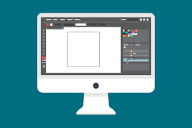

# 3D-Quests
For TTRPG (table-top role-playing game) consumers who need to play online, 
3D-Quests is a free-to-play 3D VTT (virtual table top) web app, unlike D&D 
(Dungeons and Dragons) Beyond's Signal 3D VTT or Roll20's 2D VTT. Our product 
combines affordability, accessibility, and immersion to give the best experience 
to the largest number of people.

Adding an screenshot or a mockup of your application in action would be nice.  


# How to run
- Have installed node v22.20.02
- Have installed npm and npx (it should come with node but just in case make sure to run npm -v and npx -v to see it installed)
- On the command line run the following commands:
```
npm install -g pnpm
```
```
npx prisma generate 
```
```
npx prisma generate 
```
```
pnpm dev
```
- Click on http://localhost:3000/
You're now running the website!

# How to contribute
Follow this project board to know the latest status of the project: [http://...]([http://...])  

### How to build
- Use this github repository: ... 
- Specify what branch to use for a more stable release or for cutting edge development.  
- Use InteliJ 11
- Specify additional library to download if needed 
- What file and target to compile and run. 
- What is expected to happen when the app start. 
